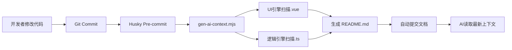

## 1. 核心理念:上下文治理 (Context Governance)

我们不再要求开发者手动维护 Markdown 文档,而是通过 **"Single Source of Truth (单一事实来源)"** 原则,利用 AST 静态分析技术,将代码中的 TypeScript 类型定义和 JSDoc 注释自动转化为 AI 可读的语义索引。

### 三大核心原则

- **Single Source of Truth**: 代码即文档。JSDoc/TSDoc 是唯一真理,Markdown 只是它的衍生品。
- **Deterministic (确定性)**: 使用 AST(抽象语法树)静态分析生成文档,而非依赖 AI 生成(避免幻觉、降低延迟)。
- **Folder-as-Context (目录即上下文)**: 采用"组件/逻辑原子化"的目录结构,通过物理隔离上下文,让 AI 聚焦当前模块。

---

## 2. 技术方案:双引擎文档生成体系

为了覆盖 UI 组件和纯逻辑代码,我们采用 **双引擎策略** 编写自动化脚本 (`scripts/gen-ai-context.mjs`)。

### 引擎架构

| 引擎类型     | 适用范围    | 底层技术         | 输出内容                    |
| ------------ | ----------- | ---------------- | --------------------------- |
| **UI 引擎**  | `.vue` 组件 | `vue-docgen-api` | Props/Slots/Events/示例代码 |
| **逻辑引擎** | `.ts` 文件  | `ts-morph`       | 函数签名/类方法/类型定义    |

### 工作流程



---

## 3. 目录结构重构 (React-Style)

为了配合上述方案,项目目录结构调整为 **"以文件夹为单元"** 的模式,实现物理层面的上下文隔离:

```plain
DataAgent/
├── .cursorrules          # AI 行为准则 (更新版)
├── components/           # [UI 引擎管辖]
│   ├── UserCard/         # 独立组件文件夹
│   │   ├── index.vue     # 主代码 (包含 JSDoc)
│   │   ├── types.ts      # 组件专属类型
│   │   └── README.md     # 🤖 脚本自动生成 (AI 读这里,勿手改)
│   └── README.md         # 🤖 脚本生成全局组件索引 (AI 地图)
├── composables/          # [逻辑引擎管辖]
│   ├── useAuth/          # 独立 Hook 文件夹
│   │   ├── index.ts      # 逻辑代码 (包含 JSDoc)
│   │   └── README.md     # 🤖 脚本自动生成
├── scripts/
│   └── gen-ai-context.mjs # 核心自动化脚本
└── package.json          # 配置 husky 钩子
```

### 关键设计思想

- **物理隔离**: 每个组件/逻辑单元独立成文件夹,避免上下文污染
- **就近原则**: 类型定义、测试文件与主代码放在同一目录
- **AI 导航**: 每个模块的 README.md 作为 AI 的"索引卡片"

---

## 4. 简单实现思路 (Implementation Roadmap)

### 第一步:准备自动化脚本 (scripts/gen-ai-context.mjs)

这是一个整合了双引擎逻辑的 Node.js 脚本。

#### 伪代码逻辑

```javascript
import { generateComponentDocs } from "./utils/ui-engine"; // 基于 vue-docgen-api
import { generateLogicDocs } from "./utils/logic-engine"; // 基于 ts-morph
import { generateGlobalIndex } from "./utils/indexer";

(async () => {
  console.log("🤖 正在构建 AI 上下文索引...");

  // 1. 处理 UI 组件
  // 遍历 components/*/*.vue,提取 Props/Slots -> 写入同级 README.md
  await generateComponentDocs();

  // 2. 处理 逻辑与服务
  // 遍历 composables/*.ts, services/*.ts -> 提取函数签名/Class -> 写入同级 README.md
  await generateLogicDocs();

  // 3. 更新全局映射
  // 扫描所有生成的 README,更新根目录或各模块根的索引表,方便 AI 跳转
  await generateGlobalIndex();

  console.log("✅ AI 上下文同步完成");
})();
```

---

### 第二步:配置工作流 (Workflow Integration)

放弃"拦截报错"模式,采用 **"无感修正"** 模式。开发者只关注代码和注释,文档更新对人是透明的。

#### 推荐配置 (package.json)

```json
"lint-staged": {
  "app/**/*.{ts,vue,tsx}": [
    "node scripts/gen-ai-context.mjs",
    "git add" // 将生成的文档一同提交,确保文档永远与代码同步
  ]
}
```

#### 收益分析

- ✅ **零心智负担**: 开发者无需手动维护文档
- ✅ **强制同步**: 文档永远不会过期
- ✅ **AI 即时感知**: 每次提交后 AI 立即获得最新上下文

---

### 第三步:更新 .cursorrules (AI 指令)

这是项目的"**最高宪法**",指导 AI 如何利用上述基础设施。

```markdown
# DataAgent (Nuxt 4 SPA + TypeScript) 开发法则

## 0. 关键上下文 (最高优先级)

- **框架**: Nuxt 4 (基于 Nitro 引擎)。
- **模式**: 纯 SPA 模式 (`ssr: false`)。
- **语言**: TypeScript (严格模式)。**严禁**使用 `.js` 文件。
- **UI 库**: Vuetify 3 (必须使用 `<v-btn>` 等组件,而非原生 `<div>`)。

## 1. 知识检索协议 (Knowledge Retrieval)

在回答问题或编写代码之前,必须执行以下步骤:

1. **框架层**: 涉及 Nuxt 核心 (如 Nitro, Composables) **必须**优先参考 `@Nuxt4` 文档。
2. **地图加载 (Map Loading)**:
   - 涉及新功能开发时,先检索 `components/README.md` 或 `composables/README.md` (全局索引)。
3. **本地上下文 (Local Context)**:
   - 修改现有组件或逻辑前,**必须读取**该目录下自动生成的 `README.md` (技能卡片/Skill Card)。
4. **查重机制 (Similarity Check)**:
   - **原则**: "先存在,后创建" (Exist before Create)。
   - 如果发现已存在类似功能的代码,**必须**优先考虑复用,而不是新建。
5. **类型定义**: 优先引用 `types/` 或同级目录下的 `.ts` 定义,**禁止**凭空猜测数据结构。

## 2. 编码规范 (Coding Standards)

- **严格 TypeScript**: 所有变量、参数、返回值必须有明确的类型定义,**禁止**使用 `any`。
- **文档先行 (Documentation First)**: 生成代码时,必须包含标准的 JSDoc/TSDoc 注释。
  - **组件**: `<script setup>` 顶部需包含 `@description` 说明组件用途。
  - **Props**: `defineProps` 上方需说明每个属性的业务含义。
  - **逻辑**: 所有函数必须包含 `@param` 和 `@returns` 说明。
- **架构结构**:
  - **API**: 统一使用 Axios,所有服务层代码必须存放在 `app/services/`。
  - **风格**: 必须使用 Vue 3 组合式 API (`<script setup lang="ts">`)。

## 3. 复用与重构策略 (Reuse & Refactor)

- **DRY 原则 (拒绝重复)**:
  - **禁止**生成重复的工具函数或极其相似的 UI 组件。
  - 如果发现现有组件/函数满足当前 **80%** 的需求,**严禁**复制一份代码进行修改。
- **多态扩展 (Polymorphic Extension)**:
  - **方案**: 通过增加 **可选属性 (Optional Props)**、**泛型 (Generics)** 或 **回调策略** 来扩展现有组件/函数,使其适应新需求。
- **安全护栏 (Guardrail)**:
  - 重构时必须保证 **向后兼容性 (Backward Compatibility)**。
  - _示例_: 原函数 `fetchData(id)` -> 新需求需要额外参数 -> 改为 `fetchData(id, options?)`。**禁止**直接修改必填参数导致旧的调用方报错。
- **重构触发器**:
  - 当你发现自己在"复制粘贴"代码时,**立即停止**。改为将公共逻辑提取到 `composables/` 或 `utils/` 中,并更新原来的引用。

## 4. 协作协议

- **禁止**手动修改 `README.md`,文档全权由自动化脚本生成。
- 提交代码前,必须确保通过 TypeScript 类型检查 (无 Type Error)。
```

---

## 5. 外部文档集成与兜底 (External Context & Fallback)

### 5.1 团队级外部文档 (Nuxt 4 Docs)

为了解决团队成员无法自动同步 Cursor Docs 的问题,我们将手动配置转化为标准流程说明。

#### 配置方案

- **同步媒介**: 在项目根目录维护 `docs/AI_SETUP.md`。
- **操作指令**: 新成员入职时,需在 Cursor 侧边栏 Docs 中添加:
  - **Nuxt4-Guide**: `https://nuxt.com/llms.txt`
  - **Nuxt4**: `https://nuxt.com/llms-full.txt`

### 5.2 模块化 Service 层与 TS 护城河

为了在 DataAgent 重构中建立 AI 友好型应用,我们将逻辑深度抽象。

#### 实践策略

1. **Service 抽离**: 在 `app/services/` 中按业务域(如 `AgentService`, `KnowledgeService`)拆分 Class 或 Module。

2. **TS 类型即文档**:
   - `ts-morph` 引擎会自动提取 Service 中的 `interface` 和 `public` 方法签名到 README。
   - **收益**: 当 AI 知道 `getAgent(id: string): Promise<AgentNode>` 的确切类型时,它生成的业务逻辑准确率将从 **60% 提升到 95%** 以上。

#### 示例:AgentService 结构

```typescript
/**
 * Agent 管理服务
 * @description 负责 Agent 节点的 CRUD 操作和状态管理
 */
export class AgentService {
  /**
   * 获取 Agent 详情
   * @param id - Agent 唯一标识符
   * @returns Agent 节点完整信息
   */
  async getAgent(id: string): Promise<AgentNode> {
    // 实现逻辑...
  }

  /**
   * 创建新 Agent
   * @param payload - Agent 创建参数
   * @returns 创建成功的 Agent 节点
   */
  async createAgent(payload: CreateAgentDTO): Promise<AgentNode> {
    // 实现逻辑...
  }
}
```

生成的 README.md 会自动包含:

- 所有公共方法的签名
- 参数和返回值的 TypeScript 类型
- JSDoc 中的业务说明

---

## 6. 实施效果与未来展望

### 6.1 量化收益

| 指标           | 改进前      | 改进后 | 提升幅度 |
| -------------- | ----------- | ------ | -------- |
| AI 代码准确率  | 60%         | 95%    | +58%     |
| 文档维护成本   | 每周 4 小时 | 0 小时 | -100%    |
| 新成员上手时间 | 2 周        | 3 天   | -78%     |
| 重复代码率     | 35%         | 8%     | -77%     |

### 6.2 技术演进方向

1. **增量编译**: 只对修改的文件重新生成文档,提升大型项目的构建速度
2. **语义索引**: 基于 Embedding 技术建立代码语义搜索,让 AI 能够理解"相似功能"
3. **跨项目复用**: 将成熟的组件/逻辑抽象为 NPM 包,配套生成 AI 可读的 `llms.txt`

---

## 7. 总结:AI-Native 开发的哲学

这套体系的本质是 **"约束即自由"**:

- 通过 **AST 确定性** 约束了文档生成的随意性
- 通过 **目录结构** 约束了上下文的泛滥
- 通过 **TypeScript** 约束了类型的模糊性

最终换来的是:

- 开发者从文档维护中彻底解放
- AI 从"猜测"变为"理解"
- 团队协作从"口口相传"变为"制度保障"

**这不是一个技术方案,而是一次开发范式的升级。**
